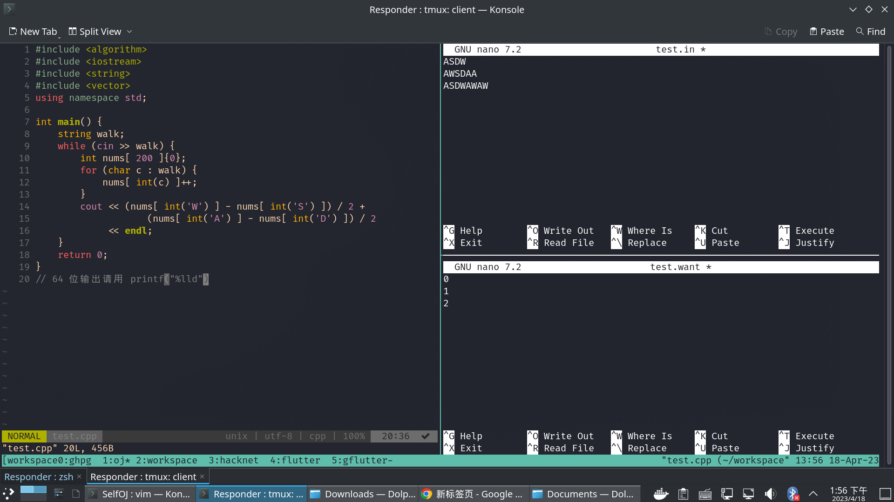

# SelfOJ
*你自己的本地OJ*

输入输出使用Acm方式，即从命令行输入/输出
本项目主要目标是收集题目/输入输出，并给出相对友好的刷题体验。
默认语言是C++，使用其他语言及编译器可以参考[这里](使用其他语言)
非常期待您为本项目作出贡献，请参考[这里](完善项目)

# 使用

1. 在类Unix系统上使用本项目，Windows可以安装Linux子系统。
2. 使用git clone 本项目

`git clone https://github.com/ProtossGenius/SelfOJ.git`

3. 找到想要做的题目，在主目录使用python3 open 'Path-To-Problem'
4. 在test.cpp文件中编写自己的代码
5. 在test.in文件中填入输入用例，在test.in.want中填入预期的输出

6. 运行make test，运行你自己的测试用例
7. 运行make submit，运行正式的测试用例（模拟提交）

# 使用其他语言
参考Makefile中的`submit:`,`qrun`的实现

# 完善项目

1. 基本只加了最简单的测试用例，需要补充边界条件

2. 标准程式是我自己写的，不一定是最优解，欢迎捉虫

3. 欢迎补充更多的题目

# 添加题目

1. 新建一个目录，在该目录下的README.md中填入题目信息/输入输出，特别注意的是请指定输入的数值范围
2. 提供一个标准程式，命名为Standard.*拓展名*，在合并请求时将依靠这个检查输入/输出是否存在错误
注意：标准程式以可读性为第一要义，不要为了炫技使用超能力。
3. 添加time.limit，内容timeout 命令的参数，如3s
注意：请关注在本地的运行时间，不要把时间设得太紧，不然就变成电脑性能大比拼了。
4. 添加标准输入输出，样式推荐为[你的github名]-[数字].[拓展名]
拓展名`.in.want`代表预期值，`.in`代表输入值
注意：时间限制是指每个输入文件的运行时间限制，所以请不要制造超大的文件，可以用数字将其分开
5. 在本地测试通过
6. 可以在主目录添加环境，调用python add '预期目录' 来自动化完成这一过程，脚本会将所有需要的发到指定目录，如果缺少内容会给出错误提示
注意：题目描述文件名应该为`Problem.md`
7. 除了经典题目外，请尽量不要添加能在网上OJ平台已有的题目
